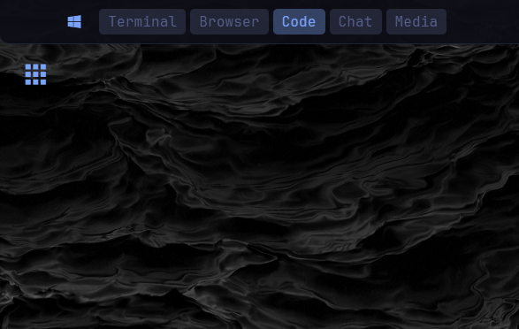
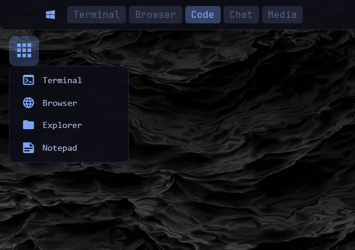

# App Launcher for Zebar

A configurable app launcher widget for [Zebar](https://github.com/glzr-io/zebar). Adds a waffle-menu button that opens a dropdown to launch your favorite apps.


## Features

- **Two layout modes** — embed flush in your bar or float standalone
- **Configurable apps** — add any app with a name, Nerd Font icon, and command
- **Themeable** — all colors customizable via `config.json`
- **Click-outside & Escape to close** — dropdown dismisses naturally
- **Dynamic window resizing** — embedded mode keeps a tiny footprint when closed, expands on click
- **Auto-flip dropdown** — automatically opens upward when the widget is near the bottom of the screen

## Installation

1. Copy the `app-launcher` folder to `~/.glzr/zebar/`
2. Add a startup config to `~/.glzr/zebar/settings.json`:

```json
{
  "startupConfigs": [
    {
      "pack": "app-launcher",
      "widget": "app-launcher",
      "preset": "floating"
    }
  ]
}
```

3. Restart Zebar

## Presets

| Preset | Description |
|--------|-------------|
| `floating` | Standalone button below the bar (default) |
| `embedded` | Flush with the bar's top-left corner |
| `embedded-bottom` | Flush with the bar's bottom-left corner |

Change the `"preset"` value in `settings.json` to switch modes.

When using `embedded`, also set `"mode": "embedded"` in `config.json` so the widget styles and window resizing adjust accordingly.

## Configuration

All settings live in a single `config.json` file:

```json
{
  "mode": "embedded",
  "bar": {
    "height": 40,
    "offsetX": 0
  },
  "theme": {
    "background": "rgba(13 14 22 / 92%)",
    "foreground": "#a9b1d6",
    "accent": "#7aa2f7",
    "hover": "rgba(122 162 247 / 18%)",
    "active": "rgba(122 162 247 / 28%)",
    "border": "rgba(122 162 247 / 15%)"
  },
  "apps": [
    { "name": "Terminal", "icon": "nf nf-md-console", "command": "wt.exe" },
    { "name": "Browser", "icon": "nf nf-md-web", "command": "msedge.exe" },
    { "name": "Explorer", "icon": "nf nf-md-folder", "command": "explorer.exe" },
    { "name": "Notepad", "icon": "nf nf-md-note_text", "command": "notepad.exe" }
  ]
}
```

### Mode

- `"floating"` — standalone button with rounded corners and border
- `"embedded"` — flush button that blends into the bar (use with the `embedded` or `embedded-bottom` preset)

### Bar

Optional settings for bar integration. Only needed when fine-tuning embedded mode.

| Key | Default | Description |
|-----|---------|-------------|
| `height` | `40` | Button height in pixels (min 24) |
| `offsetX` | `0` | Horizontal offset for floating mode |

The dropdown direction (up or down) is detected automatically based on the widget's screen position — no manual configuration needed.

### Theme

All CSS color values. Applied at runtime, with sensible defaults as fallback.

| Key | Controls |
|-----|----------|
| `background` | Dropdown and button background |
| `foreground` | Text color |
| `accent` | Icon color and active borders |
| `hover` | Hover highlight |
| `active` | Active/pressed highlight |
| `border` | Button and dropdown border |

### Apps

Each entry in the `apps` array has three fields:

| Field | Description |
|-------|-------------|
| `name` | Display label shown in the dropdown |
| `icon` | [Nerd Font](https://www.nerdfonts.com/cheat-sheet) icon class |
| `command` | Program to launch (see below) |

#### Customizing the app list

Edit the `"apps"` array in `config.json`. Add, remove, or reorder entries — the dropdown renders them in the order listed. Restart Zebar after making changes.

```json
"apps": [
  { "name": "VS Code", "icon": "nf nf-md-microsoft_visual_studio_code", "command": "code" },
  { "name": "Spotify", "icon": "nf nf-md-spotify", "command": "spotify.exe" },
  { "name": "Discord", "icon": "nf nf-md-chat", "command": "discord.exe" },
  { "name": "Firefox", "icon": "nf nf-md-firefox", "command": "firefox.exe" }
]
```

#### Finding the right command

The `command` field is passed to `cmd /c start`, so anything you can type into the Windows Run dialog (`Win+R`) will work here.

- **Apps in PATH** — use the exe name directly: `wt.exe`, `notepad.exe`, `code`, `spotify.exe`
- **Apps not in PATH** — use the full path: `C:\\Program Files\\Mozilla Firefox\\firefox.exe`
- **Tip**: to check if an app is in PATH, open a terminal and type the exe name. If it launches, you can use that name directly

#### Choosing an icon

Icons use [Nerd Fonts](https://www.nerdfonts.com/) classes. To find the right icon:

1. Go to the [Nerd Fonts Cheat Sheet](https://www.nerdfonts.com/cheat-sheet)
2. Search for your app (e.g. "spotify", "firefox", "folder")
3. Click the icon to copy its name (e.g. `nf-md-spotify`)
4. Prefix with `nf ` in the config: `"icon": "nf nf-md-spotify"`

Some useful icons:

| Icon class | Description |
|------------|-------------|
| `nf nf-md-console` | Terminal / command line |
| `nf nf-md-web` | Generic browser |
| `nf nf-md-firefox` | Firefox |
| `nf nf-md-google_chrome` | Chrome |
| `nf nf-md-microsoft_edge` | Edge |
| `nf nf-md-microsoft_visual_studio_code` | VS Code |
| `nf nf-md-spotify` | Spotify |
| `nf nf-md-folder` | File explorer |
| `nf nf-md-note_text` | Notepad / text editor |
| `nf nf-md-chat` | Chat / messaging |
| `nf nf-md-gamepad_variant` | Gaming |
| `nf nf-md-cog` | Settings |

## Screenshots

| Floating (closed) | Floating (open) |
|---|---|
|  |  |

| Embedded (closed) | Embedded (open) |
|---|---|
|  |  |

## Requirements

- [Zebar](https://github.com/glzr-io/zebar) v3.0+
- Windows 10/11

## License

MIT
